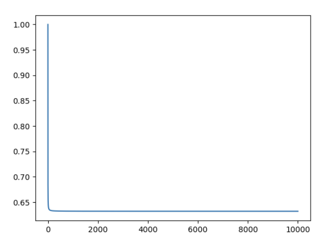

# Conceptual

## 1.
Let $\ Z = \alpha X+(1-\alpha)Y$, Then we have
$$\\
\begin{aligned}\\
    
   Var(z) &= \alpha^2Var(X) + (1-\alpha)^2Var(Y) + 2\alpha(1-\alpha)Cov(X, Y) \\
   \frac{\partial Var(Z)}{\partial \alpha}  &= 2(Var(X) + Var(Y) - Cov(X, Y))\alpha -2Var(Y) + 2Cov(X, Y)
\end{aligned}
$$
To satisfy $\frac{\partial Var(Z)}{\partial \alpha} = 0$, we obtain $\alpha = \frac{Var(Y) - Cov(X, Y)}{Var(X) + Var(Y) - 2Cov(X, Y)}$

## 2. 
(a) $P(X_{B1} \neq X_j) = \frac{n-1}{n}$ 

(b) $P(X_{B2} \neq X_j) = \frac{n-1}{n}$

(c) $P(X_{Bi} \neq X_j) = \frac{n-1}{n}$, since {X_i} are independent,  $P(X_{B1}, X_{B2}, ... X_{Bn} \neq X_j) = (\frac{n-1}{n}) ^n $

(d) 0.6723199999999999

(e) 0.6339676587267709

(f) 0.6321389535670295

(g) 
 The curve monotonically decrease.

(h) The frequency of 5-th obeservation being chosen is 0.0089, lower than the expectation of 5-th observation showing up in a bootstrap sample. The event $X_{Bi} = X_j$ obeys Binomial Distribution $B(1, 0.01)$. According to Central Limit Theorem, 
$$\\
\begin{aligned}\\
    P(N < 89) &= \frac{89-\mu}{\sqrt{n} \sigma} \\
    \sigma &= \frac{-11}{100*0.0099} \\
    &= \Phi(-11.11) \approx 0.0000
\end{aligned}
$$
Thus we can say this random generator is not giving fifth observation an equal probability of getting chosen.

## 3.
(a)
- Dividing the training set into k folds.
- For i from 1 to k, use the i-th fold as the validation set and the rest folds as the training set. Using the traning set to select predictors and model(hype parameters), and use i-th fold (validation set) to predict the error of the model.
- For each validation set, we can obatain a MSE curve relative to hype parameters.
- We take average of all bias of the same hype parameters.
- We use the hype parameters that have the lowest bias/error to builde our model.

(b)

i. Validation Set Approach

Cons: 
- Cross-Validation has less variablity compared to Validation Set Approach. 
- Validation Set Approach only use training set to fit the model, which leads to worse performance and overestimated the biase.

Pros: 
- Expensive in calculation

ii. LOOCV

Cons: 
- Less expensive in calculation, especially when the number of obeservations is large
- k-fold often gives  more accurate estimates of test error rate. LOOCV uses almost the identical training set of observations, the results are highly correlated.

Pros:
- LOOCV has a lower bias for insample estimated MSE.

### 4.
(Using Bootstrap)
- Resample $n$ observations from the sample $B$ times with replacement, and get $B$ data sets.
- Use each data set to train the model and predict $\hat{Y}_i$.
- Gven the {$\hat{Y}_i$}, we calcualte the standard deviation of the prediction 